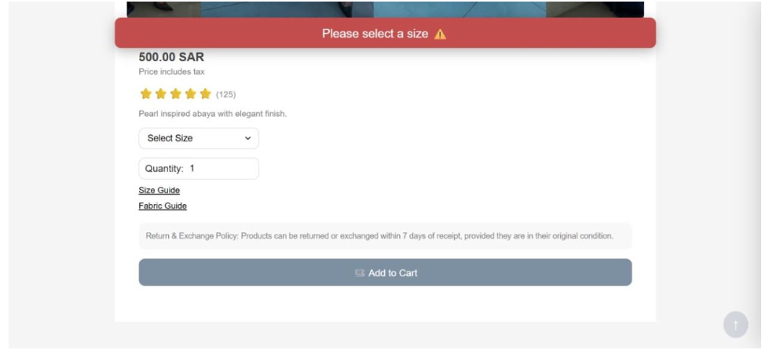
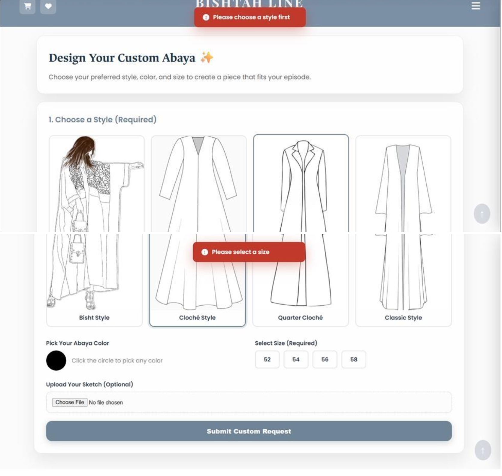
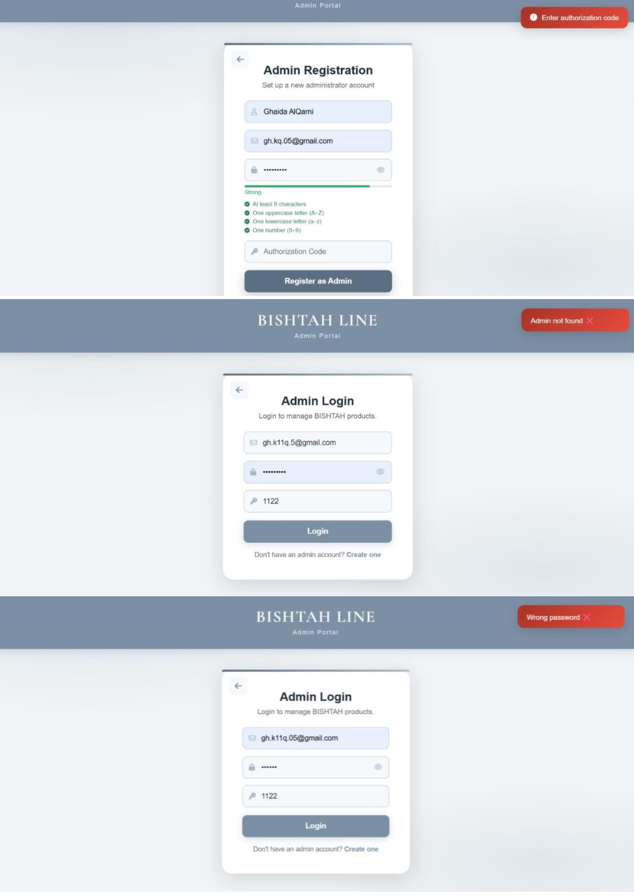

# Bishtah Line

Bishtah Line is a full-stack e-commerce platform designed for browsing, customizing, and purchasing Abayas.

## Project Overview
The platform provides customers with a complete shopping experience while offering administrators tools to manage products, orders, and customer interactions.

## Key Features
- Product browsing
- Product details
- Size guide
- Shopping cart
- Checkout
- Wishlist
- Custom Abaya orders
- Customer authentication
- Admin authentication
- Product management
- Order management
- Input validation
- Database integration

## Technologies
- HTML
- CSS
- JavaScript
- PHP
- MySQL

## My Contribution
I worked on:
- All Abayas page
- Product Details
- Size Guide
- User role functionality

## Software Quality
The project also included:
- Functional testing
- Input validation
- Database design
- ERD
- SQL queries
- Admin and customer workflow testing

## Screenshots

### Home Page

### Product Details

### Shopping Cart

### Custom Abaya

### Admin Dashboard

## Team Project
Bishtah Line was developed as a university team project at Imam Abdulrahman Bin Faisal University.
